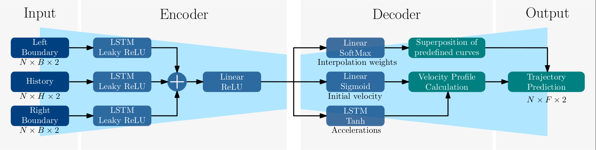
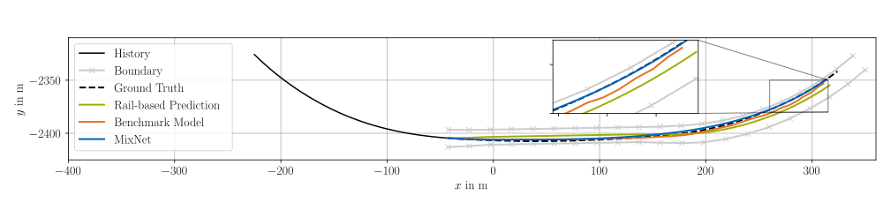

[](https://doi.org/10.5281/zenodo.6953977)
[](https://svgshare.com/i/Zhy.svg)
[](https://www.python.org/downloads/release/python-380/)
[](http://perso.crans.org/besson/LICENSE.html
# MixNet

### Structured Deep Neural Motion Prediction for Autonomous Racing



This repository provides a deep neural network approach to prediction that incorporates semantic knowledge to guarantee the quality of the output prediction. In this way, high robustness can be achieved without compromising prediction performance. The code is embedded into a ROS2-Node, which is configured in [mix_net](mix_net). The algorithm was developed by the team TUM Autonomous Motorsport for the [Indy Autonomous Challenge 2021](https://www.indyautonomouschallenge.com/) and the [Autonomous Challenge at CES 2022](https://www.indyautonomouschallenge.com/stream).

## Requirements

- Linux Ubuntu >= 18.04
- Docker >= 18.04
- Python >= 3.8

## Installation

Clone repository:
```
git clone https://github.com/TUMFTM/MixNet.git
```

Install requirements:
```
pip install -r requirements.txt
```

Install tex extensions, necessary to plot in with desired font:
```
sudo apt-get install texlive-latex-extra texlive-fonts-recommended dvipng cm-super
```


## MixNet training and evaluation
A MixNet training can be started with the following command:
```
python train/mix_net_trainer.py
```
All parameters used for the training and evaluation are specified in the MixNet-config-files ([train config](train/configs/mix_net/trainer_params_train.json), [test config](train/configs/mix_net/trainer_params_test.json)). To run an evaluation of a trained net, add the argument `--test` and run the script again. Add `--plt_vel` to evaluate the velocity profile additionally.

## Data and Evaluation
* A sample of the raw data (`data/mix_net_sample.pkl`) and the processed data (torch.Dataloader, `data/mix_net_dataloaders/sample`) are included in the repository. Per default, the samples are used in the MixNet trainer.

* The full dataset, either raw data or the processed in torch.Dataloader-format can be downloaded [here](https://doi.org/10.5281/zenodo.6954020). To use the raw data, extract them and change the key `path` in the section `data` in the MixNet-config-file. Note that every parent directory containing .pkl-files can be specified. To use the dataloaders, extract them, set `"from_saved_dataloader": true` and specify the `dataloader_path` in the section `data` in the MixNet-config-file.

* The evaluation data is also available to [download](https://doi.org/10.5281/zenodo.6954020). Copy the folder `evaluation_data` into this repository folder `data/evaluation_data`. The details how to evaluate the data are given in the related [readme](data/evaluation_data/README.md).

## ROS2-Node
It is recommended to run the ROS2-node of the module in a Docker container. To build the related image, execute:
```
docker build --pull --tag <image_name>:<tag> .
# e.g. docker build --pull --tag mix_net:0.0.1 .
```
To run the container and launch the ROS2-node, run:
```
docker run <image_name>:<tag> ros2 launch mix_net mix_net.launch.py
# e.g. docker run mix_net:0.0.1 ros2 launch mix_net mix_net.launch.py
```
Add additional parameters to the ros2 launch command if desired, see section `Parameter and Files` below. For further details about Docker and ROS2, we refer to the official documentations.


## Parameter and Files
### Directory: `mix_net`
The directory `mix_net` contains the ROS2-node to apply the MixNet in a full software stack. 

| Files | Description |
| ------------------ | ----------------------- |
mix_net/mix_net/mix_net_node.py | ROS2 main file to apply the MixNet
mix_net/launch/mix_net.launch.py | ROS2 launch file with parameter definition

The [launch description](mix_net/launch/mix_net.launch.py) contains the following parameters:

| Parameter | Type | Default | Description
| ------------- | ------------- | ------ | ----- |
frequency | dynamic_typing | 20.0 | Cycle frequency in Hz of the node (int, float)|
track | string | IMS | Name of used race track, currently only IMS supported |
use_sim_time | boolean | False | Flag to use sim time instead of system time to replay ROS-bags
use_cuda | boolean | False | If true the GPU and cuda is used


### Directory: `tools`
The directory `tools` contains the script to visualize logged data of the applied ROS2-Node. To visualize logged data of the mix_net-node run:
```
python tools/visualize_logfiles.py
```

### Directory: `train`
The directory `train` contains the scripts to train the MixNet and the benchmark model (IndyNet).

| File | Description |
| ------------------ | ----------------------- |
mix_net_trainer.py | Training script of the MixNet
mix_net_dataset.py | Dataset class, used in mix_net_trainer.py
indy_net_trainer.py | Training script of the benchmark model (IndyNet)
indy_net_bayes.py | Bayes optimizer of the benchmark model
indy_net_evaluation.py | Evaluation script of the benchmark model

## Module configuration
The configuration of the prediction module is set in [main_params.ini](mix_net/mix_net/config/main_params.ini). There are several options to specify the prediction behavior when applying the ROS2-node. A parameter description is given in the [README](mix_net/mix_net/config/README.md).


## Qualitative Example
Below is an exemplary visualization of the prediction on a scenario on the Indianapolis Motor speedway. The input features of history, left and right boundary as well as predicted and ground truth trajectory are shown. MixNet combines the best out of two worlds: the superposition of base curves and the comprehensive, learned scenario understanding.


## Inference time
The average computation times for predicting four vehicles on a single core of an Intel i7-4720HQ 2.6 GHz CPU for MixNet is 9 ms.

## References

Phillip Karle, Ferenc Török, Maximilian Geisslinger and Markus Lienkamp "MixNet: Structured Deep Neural Motion Prediction for Autonomous Racing" (under review)
